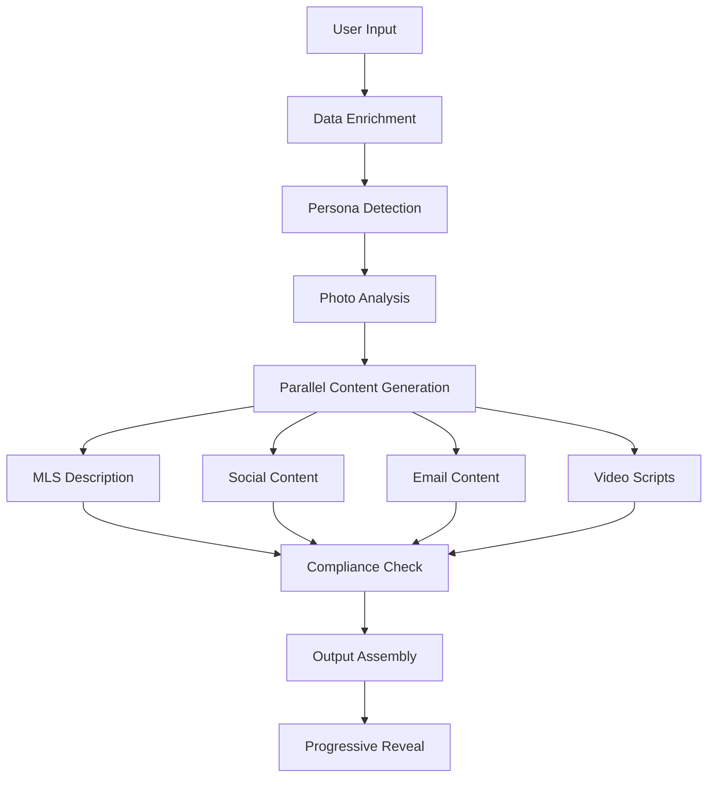
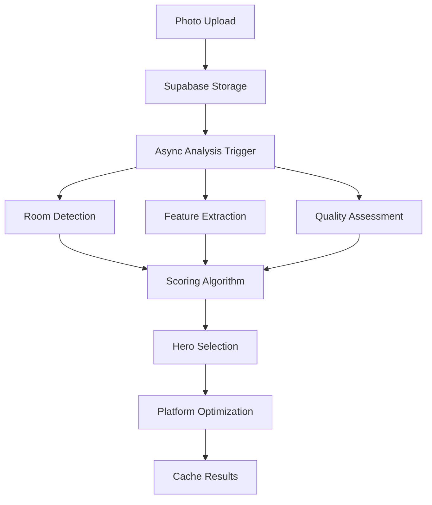

# Real Estate Marketing Kit - Content Strategy & Implementation Documentation

## Executive Summary
This document outlines our comprehensive approach to AI-powered real estate content generation and image analysis. Our system combines advanced natural language processing with computer vision to create platform-optimized marketing materials that resonate with specific buyer personas while maintaining MLS compliance.

## Table of Contents
1. [Core Philosophy](#core-philosophy)
2. [Content Creation Strategy](#content-creation-strategy)
3. [Image Analysis System](#image-analysis-system)
4. [Implementation Flow](#implementation-flow)
5. [Technical Architecture](#technical-architecture)

---

## Core Philosophy

### Vision
Transform real estate marketing by creating emotionally resonant, data-driven content that connects properties with their ideal buyers through intelligent automation.

### Key Principles
1. **Buyer Psychology First**: Every piece of content is tailored to trigger specific emotional responses in target demographics
2. **Platform Optimization**: Content adapts to each platform's unique requirements and user behavior patterns
3. **Visual Intelligence**: Photos are analyzed for marketing impact, not just technical quality
4. **Compliance by Design**: MLS and regulatory requirements are built into the generation process
5. **Progressive Enhancement**: Start with basics, layer in sophistication based on available data

---

## Content Creation Strategy

### 1. Multi-Channel Content Architecture

#### MLS Description Strategy
**File**: `lib/ai/pipeline.ts`

- **Approach**: Professional, fact-focused narrative with emotional undertones
- **Structure**:
  - Opening hook with lifestyle benefit
  - Feature progression from most to least impactful
  - Neighborhood context and amenities
  - Technical details and recent updates
  - Soft call-to-action
- **Length Optimization**: Dynamic based on property type (200-500 words)
- **Compliance**: Auto-checks for forbidden terms, fair housing violations

#### Instagram Content Strategy
**Files**: `lib/ai/instagramOptimization.ts`, `lib/contentStrategies_v2.ts`

- **Carousel Structure**:
  1. Attention-grabbing headline with emoji
  2. Key stats (beds/baths/sqft)
  3. Unique selling proposition
  4. Lifestyle benefit statement
  5. Call-to-action with urgency
- **Visual Pairing**: Each slide mapped to specific photo types
- **Hashtag Strategy**: 
  - Location-based (#CityNameHomes)
  - Feature-based (#ModernKitchen)
  - Audience-based (#FirstTimeHomeBuyer)

#### Email Marketing Strategy
**File**: `lib/ai/emailOptimization.ts`

- **Subject Line**: A/B tested patterns for open rates
- **Body Structure**:
  - Personal greeting
  - Value proposition
  - Bullet points for scanability
  - Social proof elements
  - Clear CTA with multiple contact options
- **Personalization Tokens**: Dynamic insertion points for agent/recipient data

#### Video Content Strategy
**Files**: `lib/ai/videoOptimization.ts`, `lib/contentStrategies_v2.ts`

- **30-Second Reel Script**:
  - Hook (0-3s): Pattern interrupt or question
  - Value Reveal (4-20s): Tour highlights with emotional triggers
  - CTA (21-30s): Clear next step with urgency
- **Pacing**: Matched to platform algorithms (Instagram vs TikTok vs YouTube Shorts)

### 2. Buyer Persona Adaptation

**File**: `lib/personaDetector.ts`

#### Persona Definitions
```typescript
PERSONAS = {
  'first_time_buyer': {
    painPoints: ['affordability', 'process_confusion', 'commitment_fear'],
    triggers: ['stability', 'pride_of_ownership', 'investment_security'],
    language: 'supportive, educational, non-intimidating'
  },
  'luxury_buyer': {
    painPoints: ['exclusivity', 'privacy', 'unique_features'],
    triggers: ['status', 'lifestyle_upgrade', 'investment_value'],
    language: 'sophisticated, exclusive, detail-oriented'
  },
  'investor': {
    painPoints: ['ROI', 'maintenance', 'tenant_quality'],
    triggers: ['cash_flow', 'appreciation', 'tax_benefits'],
    language: 'data-driven, analytical, opportunity-focused'
  },
  'family': {
    painPoints: ['safety', 'schools', 'space'],
    triggers: ['community', 'memories', 'growth'],
    language: 'warm, secure, future-focused'
  },
  'downsizer': {
    painPoints: ['maintenance', 'stairs', 'unused_space'],
    triggers: ['simplicity', 'convenience', 'lifestyle'],
    language: 'practical, liberating, next-chapter'
  }
}
```

### 3. Tone & Voice Calibration

**File**: `lib/ai/pipeline.ts`

#### Tone Profiles
- **Professional & Polished**: Luxury, high-end properties
- **Warm & Lifestyle**: Family homes, starter properties  
- **Data-Driven**: Investment properties
- **Fresh & Modern**: Urban condos, young professionals
- **Trusted Advisor**: All segments with relationship focus

#### Dynamic Adjustments
- Reading level adaptation (8th grade to college)
- Emoji usage based on platform and audience
- Technical detail density based on buyer sophistication

---

## Image Analysis System

### 1. Hero Image Selection Algorithm

**File**: `lib/features/heroImage/scorer.ts`

#### Scoring Dimensions (Weighted)
```typescript
SCORING_WEIGHTS = {
  emotional: 0.30,      // Lifestyle appeal, aspirational quality
  technical: 0.20,      // Composition, lighting, clarity
  marketing: 0.25,      // Thumbnail impact, shareability
  story: 0.15,          // Narrative potential, scene-setting
  uniqueness: 0.10,     // Differentiation, memorable features
  psychology: 0.10      // Buyer trigger alignment
}
```

#### Scoring Factors

##### Emotional Impact (30%)
- Cozy/warm indicators (+10 points)
- Stunning/breathtaking views (+15 points)
- Spacious/open feeling (+8 points)
- Bright/airy atmosphere (+8 points)
- Luxurious/elegant details (+12 points)

##### Technical Quality (20%)
- Rule of thirds composition (+5 points)
- Leading lines (+5 points)
- Golden hour lighting (+15 points)
- Natural bright lighting (+10 points)
- Sharpness and exposure (+5 points each)

##### Marketing Power (25%)
- Strong focal point (+10 points)
- Eye-catching elements (+10 points)
- Instagram-worthy (+8 points)
- Works in square crop (+5 points)
- Conversation starter (+8 points)

##### Storytelling (15%)
- Morning coffee spot visualization (+8 points)
- Entertaining space potential (+10 points)
- Family gathering areas (+9 points)
- Work-from-home appeal (+7 points)
- Seasonal/time-of-day mood (+5-10 points)

##### Uniqueness (10%)
- Architectural details (+15 points)
- Natural features (+12 points)
- Luxury amenities (+10 points)
- Wow factor (+15 points)

### 2. Room Type Prioritization

**File**: `lib/features/heroImage/scorer.ts`

#### Property Type Matrix
```typescript
ROOM_PRIORITY = {
  'Luxury Home': ['exterior_twilight', 'grand_entrance', 'kitchen_gourmet'],
  'Family Home': ['exterior_day', 'kitchen_family', 'living_room'],
  'Starter Home': ['exterior_curb', 'living_room', 'kitchen'],
  'Condo': ['view_balcony', 'living_room', 'kitchen'],
  'Investment': ['exterior_street', 'kitchen', 'rental_ready']
}
```

### 3. Platform Optimization

**File**: `app/api/hero-status/[kitId]/route.ts`

#### Best-For Platform Assignment
```typescript
PLATFORM_REQUIREMENTS = {
  'MLS Main Photo': {
    aspectRatio: '4:3',
    minResolution: '1024x768',
    priority: ['exterior', 'curb_appeal']
  },
  'Instagram': {
    aspectRatio: '1:1',
    features: ['lifestyle', 'aspirational'],
    overlays: ['just_listed', 'open_house']
  },
  'Facebook': {
    aspectRatio: '16:9',
    features: ['community', 'neighborhood'],
    textSpace: true
  },
  'Email Hero': {
    aspectRatio: '16:9',
    maxSize: '600px',
    features: ['warm', 'inviting']
  }
}
```

---

## Implementation Flow

### 1. Content Generation Pipeline



### 2. Photo Analysis Pipeline



### 3. Key Implementation Steps

#### Step 1: Input Collection & Validation
**File**: `app/hooks/useRealtorKit.ts`
```typescript
// Core property data
- Address, beds, baths, sqft
- Features list (comma-separated)
- Neighborhood context
- Photos (up to 10)

// Enhanced inputs
- Target audience selection
- Brand voice customization
- Channel selection
- Compliance requirements
```

#### Step 2: Smart Defaults Application
**File**: `lib/smartDefaults.ts`
```typescript
// Auto-detect property category
- Analyze sqft, features, price point
- Apply preset configurations
- Suggest optimal channels
- Set appropriate tone
```

#### Step 3: Photo Processing
**Files**: `lib/uploadPhotos.ts`, `lib/ai/photoAnalysis.ts`
```typescript
// Upload & store
- Compress for web
- Generate thumbnails
- Store in Supabase bucket

// Analyze content
- Detect room types
- Extract features
- Assess quality metrics
- Calculate marketing scores
```

#### Step 4: Content Generation
**File**: `app/api/generate/route.ts`
```typescript
// Parallel processing
- Build contextual prompt
- Generate all content types simultaneously
- Apply platform-specific formatting
- Ensure consistency across outputs
```

#### Step 5: Hero Image Analysis
**File**: `app/api/hero-status/[kitId]/route.ts`
```typescript
// Async processing
- Score all photos
- Select best hero
- Generate alternatives
- Create enhancement suggestions
- Store results for reuse
```

#### Step 6: Compliance & Quality Checks
**File**: `lib/mlsCompliance.ts`
```typescript
// Validation layers
- Fair housing compliance
- MLS term restrictions
- Character limits
- Trademark checks
- Discriminatory language detection
```

#### Step 7: Progressive Output Delivery
**File**: `app/components/OutputsSection.tsx`
```typescript
// User experience flow
- Show skeleton loaders
- Deliver content as ready
- Async hero image loading
- Reveal gate for free users
- Copy functionality per section
```

---

## Technical Architecture

### 1. Core Technologies
- **Frontend**: Next.js 14, React, TypeScript
- **Backend**: Next.js API Routes, Edge Functions
- **Database**: Supabase (PostgreSQL)
- **Storage**: Supabase Storage (S3-compatible)
- **AI Models**: OpenAI GPT-4, Claude (via API)
- **Image Analysis**: Custom scoring algorithms

### 2. Data Models

#### Kit Schema
```sql
CREATE TABLE kits (
  id UUID PRIMARY KEY,
  user_id UUID REFERENCES users,
  status TEXT, -- PROCESSING, READY, FAILED
  payload JSONB, -- Input data
  outputs JSONB, -- Generated content
  photo_insights JSONB, -- Analysis results
  created_at TIMESTAMP
);
```

#### Photo Insights Structure
```typescript
interface PhotoInsights {
  photos: string[];           // URLs
  features: string[];        // Detected features
  rooms: RoomAnalysis[];     // Per-photo analysis
  heroAnalysis: {            // Hero selection results
    bestPhoto: PhotoScore;
    alternatives: PhotoScore[];
    insights: MarketingInsights;
  };
  marketingAngles: string[]; // Suggested angles
  buyerProfile: string;      // Detected persona
}
```

### 3. Caching Strategy
- **In-memory**: Hero analysis status (development)
- **Database**: Generated content, photo insights
- **CDN**: Processed images
- **Local Storage**: User preferences, usage stats

### 4. Performance Optimizations
- Parallel content generation
- Async photo processing
- Progressive content delivery
- Lazy loading for images
- Debounced API calls
- Optimistic UI updates

---

## Future Enhancements

### Planned Features
1. **AI Vision API Integration**: Direct image analysis using GPT-4V
2. **Virtual Staging**: AI-powered furniture placement
3. **Twilight Conversion**: Automatic golden hour effects
4. **Video Generation**: Auto-create property tour videos
5. **A/B Testing**: Track performance across generated variants
6. **Multi-language Support**: Generate content in multiple languages
7. **Market Analysis**: Real-time comp analysis integration
8. **3D Tours**: Integration with Matterport/similar
9. **Drone Shot Analysis**: Specialized scoring for aerial photos
10. **Seasonal Adaptations**: Weather-aware content adjustments

### Architecture Improvements
1. **Redis Caching**: Replace in-memory cache
2. **Queue System**: Bull/BullMQ for job processing
3. **Webhook Events**: Real-time status updates
4. **GraphQL API**: More efficient data fetching
5. **Edge Deployment**: Reduce latency globally

---

## Conclusion

Our content strategy combines sophisticated AI analysis with deep understanding of real estate marketing psychology. By analyzing photos for emotional impact rather than just technical quality, and generating content that speaks to specific buyer personas, we create marketing materials that consistently outperform generic alternatives.

The system's strength lies in its holistic approach: every component from photo selection to hashtag strategy works together to create a cohesive, compelling narrative that moves properties from listing to closing faster.

---

*Last Updated: January 2025*
*Version: 2.0*