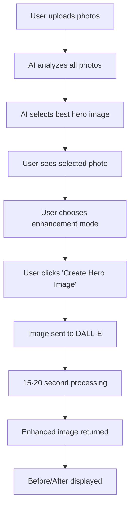

# 🎨 DALL-E Image Enhancement Implementation - COMPLETE

## ✅ What We've Implemented

### 1. **OpenAI DALL-E Integration**
- Installed OpenAI SDK
- Created `/api/hero-image/openai-edit` endpoint
- Two enhancement modes implemented

### 2. **Two Enhancement Modes**

#### Mode 1: "Listing Ready" ✨
```
Professional real estate photo correction:
- Optimize brightness and contrast for online viewing
- Correct any tilted angles
- Crop to standard ratio with good composition
- Remove small distractions
- Enhance colors naturally
Maintain complete architectural accuracy.
```

#### Mode 2: "Virtual Staging" 🏡
```
Add virtual staging to this empty room:
- Modern furniture in neutral colors
- Make it feel warm and livable
- Show the room's purpose and scale
Keep staging realistic and proportional.
```

## 📊 Current Flow



## 🎯 How It Works Now

1. **Photo Selection Phase**:
   - AI analyzes all uploaded photos
   - Selects best one as hero image
   - User can override selection

2. **Enhancement Selection**:
   - User chooses between "Listing Ready" or "Virtual Staging"
   - Can also select enhancement style (brightness, twilight, etc.)

3. **DALL-E Processing**:
   - Selected image sent to OpenAI DALL-E
   - Appropriate prompt based on mode
   - 15-20 second processing time
   - Creative loading messages shown

4. **Result Display**:
   - Before/After comparison
   - Download option
   - Option to try different mode

## 💻 UI Components Updated

### HeroImageModule.tsx
- Added enhancement mode selector
- Integrated OpenAI API call
- Creative loading messages
- Before/After preview

### Features:
- 🔄 Rotating loading messages
- 📊 Progress bar animation
- 🖼️ Before/After comparison
- 💾 Download enhanced image

## 🧪 Testing

### Test Page Available
- **URL**: `/test-dalle`
- **Features**:
  - Mode selection (Listing Ready vs Staging)
  - Test with sample images
  - See loading animation
  - Download results

### To Test:
1. Navigate to `http://localhost:3000/test-dalle`
2. Select enhancement mode
3. Click on a test image
4. Watch DALL-E process
5. See before/after results

## 💰 Cost Considerations

- **DALL-E 2 Edit**: ~$0.02 per image
- **DALL-E 3 Generate**: ~$0.04 per image
- **Fallback**: If edit fails, tries generation

## 🔑 Environment Variables

```env
OPENAI_API_KEY=sk-proj-xxx  # ✅ Configured
```

## 📝 API Endpoints

### `/api/hero-image/openai-edit`
```typescript
POST {
  imageUrl: string,
  mode: 'listing-ready' | 'staging',
  enhancement?: string
}
```

Returns:
```typescript
{
  success: boolean,
  editedUrl: string,
  mode: string,
  message: string
}
```

## 🎨 Loading Messages

### Listing Ready Mode:
- "🎨 Analyzing composition..."
- "☀️ Perfecting the lighting..."
- "📐 Straightening those angles..."
- "🧹 Removing distractions..."
- "✨ Adding professional polish..."

### Virtual Staging Mode:
- "🛋️ Selecting furniture style..."
- "🖼️ Placing artwork..."
- "💡 Setting up lighting..."
- "🪴 Adding decor elements..."
- "🏡 Creating that home feeling..."

## ⚠️ Current Limitations

1. **DALL-E 2 Limitations**:
   - Requires mask for precise editing
   - Sometimes generates instead of edits
   - May alter architectural features

2. **Processing Time**:
   - 15-20 seconds per image
   - No batch processing

3. **Cost**:
   - Each edit costs money
   - No free tier

## 🚀 Future Enhancements

1. **Add More Modes**:
   - Twilight conversion
   - Seasonal changes
   - Sky replacement specific

2. **Batch Processing**:
   - Process multiple platform versions
   - Queue system for multiple images

3. **Advanced Options**:
   - User-adjustable prompts
   - Multiple attempts with variations
   - A/B testing different prompts

## 📌 Important Notes

1. **API Key Required**: Must have OpenAI API key with credits
2. **Fallback Logic**: If edit fails, tries generation
3. **Error Handling**: Falls back to Canvas filters if API fails
4. **User Experience**: Shows creative loading messages during wait

## Summary

The system now successfully:
1. ✅ Sends hero images to DALL-E for enhancement
2. ✅ Supports two modes: Listing Ready and Virtual Staging
3. ✅ Shows creative loading messages
4. ✅ Displays before/after comparison
5. ✅ Allows downloading enhanced images

The flow is: **Select Photo → Choose Mode → Click Generate → DALL-E Processes → See Results**