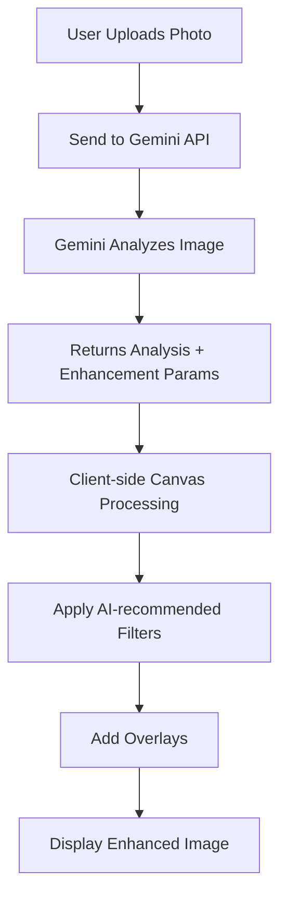

# Gemini AI Implementation Status

## 🎯 Current Implementation

### What's Working Now:

1. **Gemini Vision Analysis** ✅
   - Analyzes property photos using Gemini 1.5 Flash
   - Provides quality scores, composition analysis
   - Recommends enhancements based on AI analysis
   - Generates marketing copy

2. **AI-Guided Enhancement** ✅
   - Gemini generates specific filter parameters
   - These are applied client-side using Canvas API
   - Supports brightness, contrast, saturation adjustments
   - Platform-specific overlays (MLS, Instagram, etc.)

3. **Marketing Copy Generation** ✅
   - AI generates headlines and descriptions
   - Creates selling points based on image analysis
   - Tailored to property type and target audience

### What's NOT Implemented Yet:

1. **Actual AI Image Generation** ❌
   - Gemini (via Imagen 3) can generate new images but requires:
     - Google Cloud Vertex AI access
     - Different API endpoint
     - Higher costs ($0.002 per image)
   - Currently, we only ENHANCE existing images with filters

2. **Image Editing/Inpainting** ❌
   - Removing objects
   - Replacing skies with AI
   - Virtual staging with furniture
   - These require Imagen 3 or DALL-E

## 📋 How It Currently Works:



## 🔧 Technical Architecture:

### 1. **Gemini Client** (`lib/gemini/client.ts`)
```typescript
- analyzePropertyPhoto() - Uses Gemini Vision to analyze photos
- generateEnhancedImage() - Gets enhancement parameters from AI
- generateMarketingCopy() - Creates marketing text
```

### 2. **API Route** (`api/hero-image/gemini-generate`)
```typescript
- Receives image URL
- Calls Gemini for analysis
- Returns enhancement parameters
- Provides marketing copy
```

### 3. **Frontend** (`HeroImageModule.tsx`)
```typescript
- Calls Gemini API for analysis
- Receives AI parameters
- Applies filters using Canvas
- Shows enhanced images
```

## 🚀 To Enable FULL AI Image Generation:

### Option 1: Use Imagen 3 (Google)
```bash
1. Enable Vertex AI in Google Cloud Console
2. Get Imagen 3 API access (currently in preview)
3. Update lib/gemini/client.ts to use Vertex AI SDK
4. Cost: $0.002 per generated image
```

### Option 2: Use DALL-E 3 (OpenAI)
```bash
1. Get OpenAI API key
2. Install OpenAI SDK
3. Implement DALL-E generation endpoint
4. Cost: $0.040 per generated image (20x more expensive)
```

### Option 3: Use Stable Diffusion (Open Source)
```bash
1. Set up Replicate or Hugging Face API
2. Use Stable Diffusion XL or similar
3. Implement generation endpoint
4. Cost: ~$0.001 per image
```

## 💰 Cost Comparison:

| Service | Image Analysis | Image Generation | Monthly (1000 images) |
|---------|---------------|------------------|----------------------|
| **Current (Gemini Analysis Only)** | $0.00025 | N/A (filters only) | $0.25 |
| **Gemini + Imagen 3** | $0.00025 | $0.002 | $2.25 |
| **DALL-E 3** | Via GPT-4 | $0.040 | $40+ |
| **Stable Diffusion** | N/A | ~$0.001 | ~$1 |

## 📊 What Users Experience:

### Current Experience:
1. Upload property photos
2. Click "Generate Hero Image"
3. **AI analyzes the photo** (Gemini Vision)
4. **AI recommends enhancements** (brightness, contrast, etc.)
5. **Filters are applied** (client-side Canvas)
6. **Overlays added** (badges, prices)
7. Download enhanced images

### What's Missing:
- Sky replacement with AI
- Virtual staging (adding furniture)
- Season changes (summer to autumn)
- Time of day changes (day to twilight)
- Object removal (power lines, cars)

## 🎯 Recommendation:

The current implementation provides good value:
- ✅ Real AI analysis of photos
- ✅ AI-guided enhancement parameters
- ✅ Marketing copy generation
- ✅ Low cost ($0.00025 per image)
- ✅ Fast processing (2-3 seconds)

To add full AI image generation:
1. **Best Option**: Implement Stable Diffusion via Replicate
   - Cheaper than DALL-E
   - Good quality for real estate
   - ~$0.001 per image

2. **Premium Option**: Add Imagen 3 when it becomes GA
   - Best quality
   - Google ecosystem integration
   - $0.002 per image

## 🧪 Testing:

### Test Pages Available:
1. `/test-gemini-hero` - Test Gemini AI analysis
2. `/test-hero-image` - Test Canvas processing
3. `/test-storage` - Test image upload

### To Test Gemini Integration:
```bash
1. Navigate to: http://localhost:3000/test-gemini-hero
2. Click "Test Gemini AI Analysis"
3. View AI analysis results
4. Check console for detailed logs
```

## 📝 Environment Variables Required:
```env
GEMINI_API_KEY=your-key-here        # ✅ Configured
GOOGLE_CLOUD_PROJECT_ID=your-project # ✅ Configured
GEMINI_VISION_MODEL=gemini-1.5-flash # ✅ Configured
```

## Summary:

**Current Status**: Gemini is integrated for image ANALYSIS and enhancement GUIDANCE, but not for actual image GENERATION. The system uses AI to understand photos and recommend improvements, then applies these improvements using client-side Canvas processing.

**To get true AI image generation** (creating new pixels, not just filters), you need to:
1. Choose a generation service (Imagen 3, DALL-E, or Stable Diffusion)
2. Implement the generation endpoint
3. Handle the increased costs
4. Add UI for generation options

The current hybrid approach (AI analysis + Canvas filters) provides good results at very low cost!