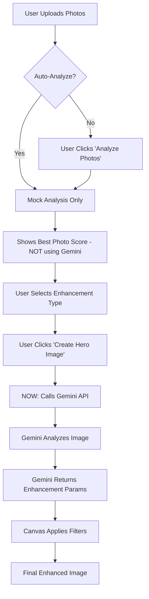
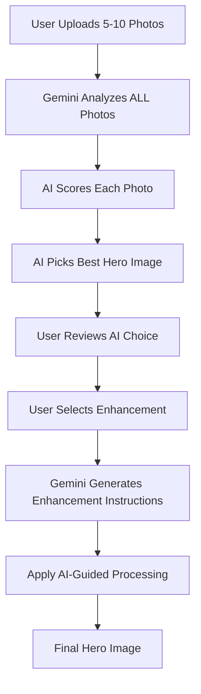

# 🤖 Gemini AI Integration: Complete Flow & Prompts

## 📊 Current Flow Diagram



## 🔴 CURRENT ISSUES:

### 1. **Gemini is NOT analyzing photos for selection** ❌
- The `analyzePhotos()` function uses MOCK data
- It doesn't call Gemini at all
- Just returns fake scores

### 2. **Gemini is ONLY called during generation** ⚠️
- Only when user clicks "Create Hero Image"
- Analyzes the already-selected photo
- Too late in the process!

## 📝 Current Prompts Being Sent

### 1. **Photo Analysis Prompt** (in `generateEnhancedImage`)
```javascript
// This is ONLY called after user clicks "Create Hero Image"
const prompt = `
  You are a professional real estate photography expert. 
  Analyze this property photo and provide a detailed assessment.
  
  Provide your analysis in the following JSON format:
  {
    "roomType": "exterior/living_room/kitchen/bedroom/bathroom/etc",
    "score": 0-100,
    "lighting": {
      "quality": 0-10,
      "type": "natural/artificial/mixed",
      "timeOfDay": "morning/afternoon/evening/night"
    },
    "composition": {
      "score": 0-10,
      "strengths": ["list of compositional strengths"],
      "improvements": ["suggested improvements"]
    },
    "marketability": {
      "score": 0-10,
      "targetBuyer": "family/luxury/investor/first-time",
      "keySellingPoints": ["list of key selling points"]
    },
    "enhancements": {
      "recommended": ["twilight", "sky_replacement", "declutter", "staging"],
      "priority": "highest priority enhancement",
      "expectedImprovement": 0-100
    },
    "description": "A compelling 2-3 sentence description for marketing"
  }
`;
```

### 2. **Enhancement-Specific Prompts**

#### For Twilight Enhancement:
```javascript
twilight: `
  Describe how to transform this property photo into a stunning twilight/golden hour shot:
  - What lighting adjustments are needed (brightness, warmth, contrast)?
  - What color grading would create the perfect sunset ambiance?
  - Should windows have warm interior lights visible?
  - What sky colors and gradients would be most appealing?
  Provide specific RGB/HSL values and adjustment percentages.
`
```

#### For Brightness Enhancement:
```javascript
brightness: `
  Analyze this property photo and describe how to enhance it for maximum appeal:
  - What brightness and contrast adjustments would optimize the image?
  - Which areas need shadow/highlight recovery?
  - What saturation and vibrance settings would make it pop?
  - Should any color temperature adjustments be made?
  Provide specific adjustment values.
`
```

#### For Sky Enhancement:
```javascript
sky: `
  Describe how to enhance or replace the sky in this property photo:
  - What type of sky would best complement the property?
  - What color palette would work best?
  - How should the lighting be adjusted to match the new sky?
  - What environmental reflections need to be considered?
`
```

## 🎯 WHAT SHOULD BE HAPPENING:

### Ideal Flow:


## 🚀 PROPOSED IMPROVEMENTS:

### 1. **Fix Photo Analysis to Use Real Gemini**
```typescript
// In HeroImageModule.tsx - analyzePhotos function
const analyzePhotos = async () => {
  setIsAnalyzing(true);
  
  // Call Gemini to analyze ALL photos
  const response = await fetch('/api/hero-image/analyze-batch', {
    method: 'POST',
    body: JSON.stringify({ 
      photos: photos,
      propertyType: propertyType 
    })
  });
  
  const geminiAnalysis = await response.json();
  // geminiAnalysis will have scores for ALL photos
  // and pick the best one
};
```

### 2. **Better Prompts for Hero Image Selection**
```javascript
const HERO_SELECTION_PROMPT = `
You are a luxury real estate marketing expert. Analyze these property photos 
and select the BEST hero image for marketing this ${propertyType}.

For each photo, evaluate:
1. First Impression Impact (0-10): Would this stop a buyer scrolling?
2. Emotional Appeal (0-10): Does it create desire to live here?
3. Technical Quality (0-10): Sharpness, lighting, composition
4. Marketing Power (0-10): How well does it sell the property?
5. Platform Suitability:
   - MLS: Professional, comprehensive view
   - Instagram: Visually striking, lifestyle focused
   - Facebook: Family appeal, warmth

Return JSON with your analysis and MOST IMPORTANTLY, 
which photo should be the HERO IMAGE and why.
`;
```

### 3. **Context-Aware Enhancement Prompts**
```javascript
const SMART_ENHANCEMENT_PROMPT = `
This is the hero image for a ${propertyDetails.price} ${propertyDetails.type} 
with ${propertyDetails.beds} bedrooms in ${location}.

Current market conditions: ${marketContext}
Target buyer: ${targetBuyer}
Competition: Properties in this range typically show ${competitionStyle}

Given this context, how should we enhance this image?
Consider:
1. Should we go for aspirational (twilight, dramatic) or approachable (bright, welcoming)?
2. What emotional tone matches the price point?
3. What enhancement would differentiate from competition?

Recommend specific adjustments that will maximize buyer interest.
`;
```

## 📋 Current Implementation Gaps:

| Feature | Expected | Actual | Status |
|---------|----------|--------|--------|
| **Photo Analysis** | Gemini analyzes all photos | Mock data only | ❌ Not Implemented |
| **Hero Selection** | AI picks best photo | Random/first photo | ❌ Not Implemented |
| **Enhancement Analysis** | Before user selects | After generation clicked | ⚠️ Wrong timing |
| **Filter Generation** | AI-specific params | Generic presets | ⚠️ Partial |
| **Image Generation** | New AI image | Filters only | ❌ Not Available |

## 🔧 Quick Fixes Needed:

### 1. **Add Real Photo Analysis Endpoint**
```typescript
// app/api/hero-image/analyze-batch/route.ts
export async function POST(request: NextRequest) {
  const { photos } = await request.json();
  
  // Use Gemini to analyze ALL photos
  const analyses = await batchAnalyzePhotos(photos);
  
  // Find best hero image
  const bestPhoto = selectBestHeroImage(analyses);
  
  return NextResponse.json({
    bestPhoto,
    alternatives: analyses.slice(0, 3),
    allScores: analyses
  });
}
```

### 2. **Update HeroImageModule to Call Real Analysis**
```typescript
// Replace mock analysis with real Gemini call
const analyzePhotos = async () => {
  // Actually call Gemini API
  const geminiAnalysis = await fetchGeminiAnalysis(photos);
  setAnalysis(geminiAnalysis);
};
```

### 3. **Add Enhancement Preview**
```typescript
// Show what AI will do BEFORE processing
const previewEnhancement = async (enhancement: string) => {
  const preview = await getGeminiEnhancementPreview(
    selectedPhoto,
    enhancement
  );
  // Show user what changes AI recommends
};
```

## 💡 Ideal User Experience:

1. **Upload Photos** → "Analyzing 8 photos with AI..."
2. **AI Analysis** → "Photo #3 scored highest (92/100) for curb appeal"
3. **Enhancement Options** → "AI recommends: Twilight for luxury appeal"
4. **Preview** → "This will adjust: +warmth, -20% brightness, golden sky"
5. **Generate** → "Applying AI enhancements..."
6. **Result** → Enhanced image with AI-optimized adjustments

## 🎨 Better Enhancement Prompts We Should Use:

### For Twilight (Luxury):
```
Transform this ${roomType} photo for luxury real estate marketing.
Target buyer: Affluent professionals seeking their dream home.
Create a twilight ambiance that suggests:
- Exclusivity and sophistication
- Warm, inviting evening atmosphere  
- Lifestyle aspiration
- Professional architectural photography quality

Specific requirements:
- Sky: Gradient from deep blue (top) to warm orange/pink (horizon)
- Windows: Warm golden glow suggesting cozy interior
- Shadows: Deep but not obscuring detail
- Overall mood: Dramatic but believable
```

### For Bright & Airy (Family):
```
Optimize this photo for family home buyers.
Make it feel:
- Safe and welcoming
- Bright and cheerful
- Move-in ready
- Perfect for children

Adjustments should emphasize:
- Natural light flooding the space
- Clean, fresh appearance
- Spaciousness
- Happy family life potential
```

## 📊 What Gemini SHOULD See:

When analyzing for hero image selection:
1. **All photos at once** (for comparison)
2. **Property context** (price, location, type)
3. **Marketing goals** (luxury vs starter, family vs investor)
4. **Platform requirements** (MLS vs social media)

## Summary:

**Current Reality**: Gemini is only called AFTER the user has already selected a photo and clicked generate. It's being used for enhancement guidance but NOT for the critical hero image selection.

**What Should Happen**: Gemini should analyze ALL photos upfront, score them, pick the best hero image, and THEN provide enhancement guidance specific to that photo and the property's marketing goals.

The prompts exist and are good, but they're being used at the wrong time in the workflow!