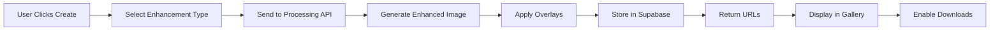
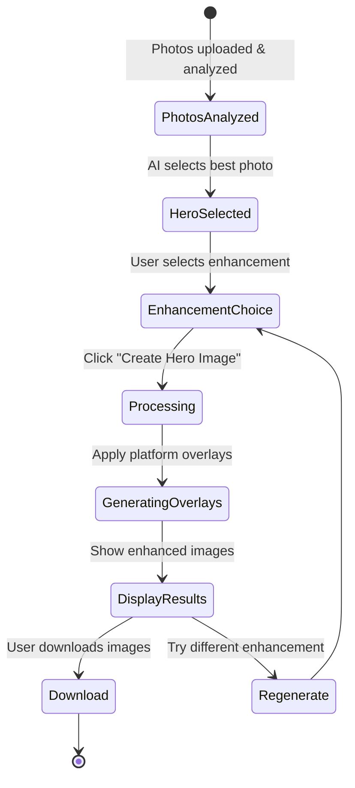

# Hero Image Feature - Complete Implementation Plan

## Current State Analysis

### What's Working ✅
1. **Photo Analysis & Scoring**: Successfully analyzes uploaded photos and scores them across 6 dimensions
2. **Hero Selection**: AI selects the best photo based on marketing impact scores
3. **Async Processing**: Hero analysis runs in background without blocking content generation
4. **UI Components**: HeroImageModule displays selected photos with scores and recommendations

### What's Missing ❌
1. **Enhancement Generation**: "Create Hero Image" button is just a placeholder
2. **Image Processing**: No actual image enhancement/overlay generation
3. **Display System**: No component to show the enhanced final images
4. **Download Functionality**: Download buttons don't work
5. **Storage**: No system to store and retrieve enhanced images

## Proposed Solution Architecture

### 1. Enhancement Pipeline Design



### 2. Enhancement Types & Processing

#### A. Basic Enhancements (Tier: FREE/STARTER)
```typescript
{
  brightness: { adjustment: +15%, preserveHighlights: true },
  contrast: { adjustment: +10%, midtoneProtection: true },
  saturation: { adjustment: +8%, skinToneProtection: true },
  skyReplacement: { type: 'blue_sky', blend: 70% }
}
```

#### B. Advanced Enhancements (Tier: PROFESSIONAL)
```typescript
{
  twilight: {
    skyGradient: 'golden_hour',
    windowGlow: true,
    landscapeLighting: 'warm',
    exposureBlend: true
  },
  hdrEffect: {
    toneMapping: 'reinhard',
    detailEnhancement: 80%,
    colorGrading: 'real_estate'
  }
}
```

#### C. Premium Features (Tier: PREMIUM)
```typescript
{
  virtualStaging: {
    style: 'modern' | 'traditional' | 'minimalist',
    roomType: 'auto_detect',
    furnitureQuality: 'photorealistic'
  },
  seasonalChange: {
    targetSeason: 'spring' | 'summer' | 'fall' | 'winter',
    foliage: true,
    lighting: true
  }
}
```

### 3. Marketing Overlays System

#### Overlay Templates
```typescript
interface OverlayTemplate {
  id: string;
  name: string;
  elements: {
    badge?: {
      text: string;
      position: 'top-left' | 'top-right';
      style: 'ribbon' | 'circle' | 'banner';
    };
    priceTag?: {
      amount: string;
      position: 'bottom-left' | 'bottom-right';
      includeDetails?: boolean; // beds, baths, sqft
    };
    agentBranding?: {
      logo?: string;
      name: string;
      phone: string;
      position: 'bottom';
    };
    callToAction?: {
      text: string;
      style: 'button' | 'text';
    };
  };
  platforms: ('mls' | 'instagram' | 'facebook' | 'email')[];
}
```

#### Platform-Specific Formats
```typescript
const PLATFORM_FORMATS = {
  mls: {
    dimensions: { width: 1024, height: 768 },
    overlays: ['price', 'agent'],
    compression: 85,
    format: 'jpg'
  },
  instagram: {
    dimensions: { width: 1080, height: 1080 },
    overlays: ['just_listed', 'swipe_for_more'],
    compression: 80,
    format: 'jpg'
  },
  instagram_story: {
    dimensions: { width: 1080, height: 1920 },
    overlays: ['sticker_style', 'link_swipe_up'],
    compression: 80,
    format: 'jpg'
  },
  facebook: {
    dimensions: { width: 1200, height: 630 },
    overlays: ['price', 'open_house', 'agent'],
    compression: 85,
    format: 'jpg'
  },
  email: {
    dimensions: { width: 600, height: 400 },
    overlays: ['simple_price', 'view_details_button'],
    compression: 70,
    format: 'jpg'
  }
};
```

### 4. Display Component Design

#### Enhanced Image Gallery
```typescript
interface EnhancedImageGallery {
  originalPhoto: string;
  enhancements: {
    id: string;
    type: string;
    url: string;
    platform: string;
    created: Date;
    downloads: number;
  }[];
  activeView: 'side-by-side' | 'slider' | 'grid';
  features: {
    beforeAfterSlider: boolean;
    instantPreview: boolean;
    bulkDownload: boolean;
    socialShareButtons: boolean;
  };
}
```

#### Display Locations
1. **Primary Display**: Inside HeroImageModule after generation
2. **Secondary Display**: Dedicated "Enhanced Images" tab in outputs
3. **Modal View**: Full-screen preview with download options
4. **Thumbnail Strip**: Quick preview of all generated variations

### 5. Storage Architecture

```sql
-- Enhanced images table
CREATE TABLE enhanced_images (
  id UUID PRIMARY KEY DEFAULT gen_random_uuid(),
  kit_id UUID REFERENCES kits(id),
  original_photo_url TEXT NOT NULL,
  enhanced_url TEXT NOT NULL,
  enhancement_type TEXT NOT NULL,
  platform TEXT,
  overlay_config JSONB,
  processing_time_ms INTEGER,
  downloads INTEGER DEFAULT 0,
  created_at TIMESTAMP DEFAULT NOW()
);

-- Create index for fast lookups
CREATE INDEX idx_enhanced_images_kit_id ON enhanced_images(kit_id);
```

### 6. API Implementation Plan

#### `/api/hero-image/generate`
```typescript
interface GenerateRequest {
  kitId: string;
  photoUrl: string;
  photoIndex: number;
  enhancement: {
    type: 'brightness' | 'twilight' | 'staging' | 'seasonal';
    intensity?: number;
    options?: Record<string, any>;
  };
  overlays: {
    badge?: string;
    price?: string;
    agentInfo?: AgentInfo;
  };
  platforms: string[];
}

interface GenerateResponse {
  success: boolean;
  images: {
    platform: string;
    url: string;
    dimensions: { width: number; height: number };
    size: number;
  }[];
  processingTime: number;
}
```

### 7. User Experience Flow



### 8. Implementation Priority

#### Phase 1: Core Enhancement (Week 1)
1. ✅ Fix "Create Hero Image" button to trigger actual processing
2. ✅ Implement basic brightness/contrast enhancement
3. ✅ Add simple overlay system (Just Listed badge, price)
4. ✅ Store enhanced images in Supabase
5. ✅ Display enhanced image in module

#### Phase 2: Platform Optimization (Week 2)
1. ⬜ Generate platform-specific dimensions
2. ⬜ Add platform-appropriate overlays
3. ⬜ Implement batch generation for all platforms
4. ⬜ Add before/after slider view
5. ⬜ Enable individual downloads

#### Phase 3: Advanced Features (Week 3)
1. ⬜ Twilight conversion algorithm
2. ⬜ Sky replacement system
3. ⬜ Virtual staging integration
4. ⬜ Bulk download as ZIP
5. ⬜ Social sharing buttons

#### Phase 4: Polish & Optimization (Week 4)
1. ⬜ Caching system for enhanced images
2. ⬜ Progress indicators with stages
3. ⬜ Undo/redo functionality
4. ⬜ A/B testing different enhancements
5. ⬜ Analytics tracking

## Technical Implementation Details

### Image Processing Options

#### Option 1: Sharp.js (Recommended for MVP)
```typescript
import sharp from 'sharp';

async function enhanceImage(imageBuffer: Buffer, options: EnhancementOptions) {
  let pipeline = sharp(imageBuffer);
  
  // Basic enhancements
  if (options.brightness) {
    pipeline = pipeline.modulate({
      brightness: 1 + (options.brightness / 100)
    });
  }
  
  // Add overlay
  if (options.overlay) {
    const overlay = await generateOverlay(options.overlay);
    pipeline = pipeline.composite([{
      input: overlay,
      gravity: options.overlay.position
    }]);
  }
  
  return pipeline.jpeg({ quality: 85 }).toBuffer();
}
```

#### Option 2: Canvas API (For Browser Processing)
```typescript
function enhanceImageCanvas(imageUrl: string, options: EnhancementOptions): Promise<Blob> {
  return new Promise((resolve) => {
    const canvas = document.createElement('canvas');
    const ctx = canvas.getContext('2d');
    const img = new Image();
    
    img.onload = () => {
      canvas.width = img.width;
      canvas.height = img.height;
      
      // Apply filters
      ctx.filter = `brightness(${options.brightness}%) contrast(${options.contrast}%)`;
      ctx.drawImage(img, 0, 0);
      
      // Add overlays
      if (options.overlay) {
        drawOverlay(ctx, options.overlay);
      }
      
      canvas.toBlob(resolve, 'image/jpeg', 0.85);
    };
    
    img.src = imageUrl;
  });
}
```

#### Option 3: External API (For Advanced Features)
- **Replicate API**: For AI-powered enhancements
- **Cloudinary**: For image transformations
- **Remove.bg**: For background replacement
- **Photomosh**: For artistic effects

### Performance Considerations

1. **Async Processing**: All enhancements run in background
2. **Progressive Loading**: Show low-res preview immediately
3. **CDN Caching**: Cache enhanced images at edge
4. **Lazy Generation**: Only generate requested platforms
5. **Queue System**: Handle multiple requests efficiently

### Error Handling

```typescript
class HeroImageError extends Error {
  constructor(
    message: string,
    public code: string,
    public retryable: boolean = true
  ) {
    super(message);
  }
}

// Usage
try {
  const enhanced = await enhanceImage(photo, options);
} catch (error) {
  if (error instanceof HeroImageError && error.retryable) {
    // Retry with exponential backoff
    await retryWithBackoff(() => enhanceImage(photo, options));
  } else {
    // Show user-friendly error
    showError('Enhancement temporarily unavailable');
  }
}
```

## Success Metrics

1. **User Engagement**
   - % of users who generate hero images
   - Average enhancements per session
   - Download rate per platform

2. **Performance**
   - Average processing time < 3 seconds
   - Success rate > 95%
   - Cache hit rate > 70%

3. **Business Impact**
   - Increased tier upgrades for advanced features
   - Higher user retention
   - Positive feedback on enhanced images

## Conclusion

This implementation plan provides a complete roadmap for turning the hero image feature from a UI prototype into a fully functional image enhancement system. The phased approach allows for quick MVP delivery while building toward premium features that drive upgrades.

The key is to start with basic enhancements that work reliably, then progressively add more sophisticated features based on user feedback and usage patterns.