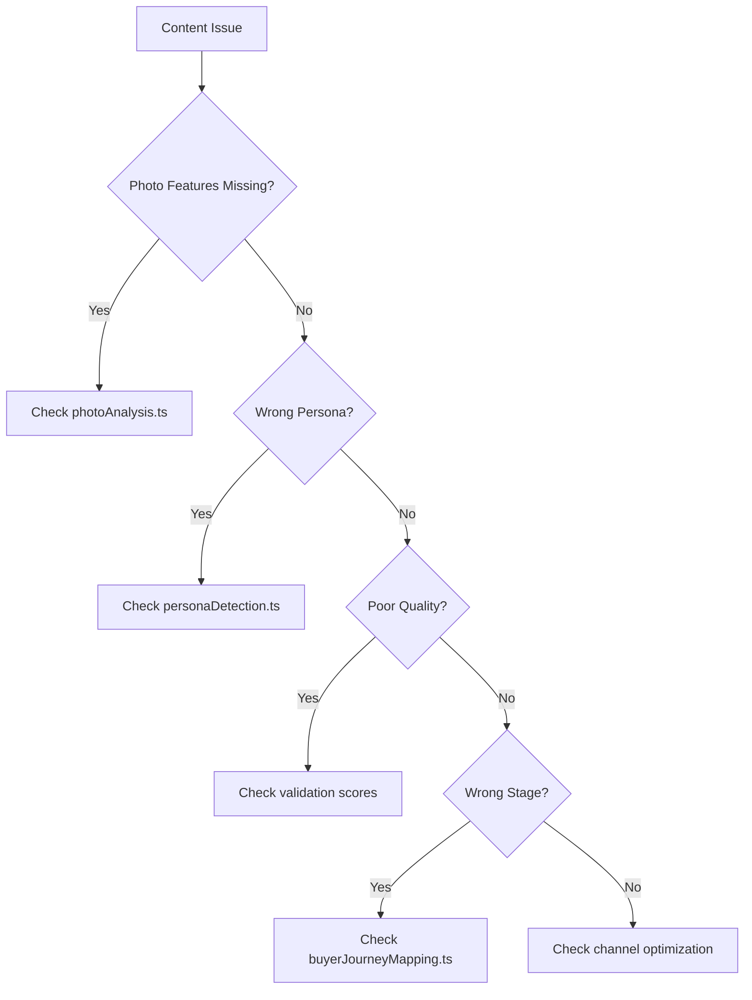

# Technical Implementation Guide - Phase 2 & 3 Systems

## Table of Contents
1. [System Architecture Overview](#system-architecture-overview)
2. [Phase 2: Channel Optimization](#phase-2-channel-optimization)
3. [Phase 3: Intelligent Personalization](#phase-3-intelligent-personalization)
4. [Content Generation Pipeline](#content-generation-pipeline)
5. [Debugging Guide](#debugging-guide)
6. [Impact on Output](#impact-on-output)

---

## System Architecture Overview

### Data Flow Sequence
```
User Input → Photo Analysis → Buyer Psychology → Channel Optimization 
→ Buyer Journey Mapping → Persona Detection → Content Personalization 
→ Validation → Output
```

### Key Integration Points
- **Entry**: `lib/generator.ts` - Main orchestrator
- **Processing**: `lib/ai/pipeline.ts` - AI pipeline coordinator
- **Output**: Channel-specific formatters in `lib/ai/*Optimization.ts`

---

## Phase 2: Channel Optimization

### 2.1 Channel-Specific Content Strategies

#### MLS Optimization (`lib/ai/mlsOptimization.ts`)

**Purpose**: Generate search-optimized property descriptions

**Key Functions**:
```typescript
generateMLSDescription(
  basicInfo: BasicPropertyInfo,
  photoInsights: PhotoInsights,
  buyerProfile?: BuyerProfile
): MLSContent
```

**How it affects output**:
- Adds 10-15 searchable keywords per description
- Structures content with headline → features → lifestyle → CTA
- Integrates photo-specific features in first paragraph
- Optimizes for MLS search algorithms

**Expected output characteristics**:
- 150-300 words for standard listings
- 300-500 words for luxury properties
- Keywords naturally integrated (not stuffed)
- Features from photos prominently mentioned

**Debug checkpoints**:
```typescript
// Check if MLS content includes photo features
console.log('MLS photo features integrated:', 
  output.mlsDesc.includes(photoInsights.sellingPoints[0]));
```

---

#### Instagram Optimization (`lib/ai/instagramOptimization.ts`)

**Purpose**: Create viral social media content

**Key Functions**:
```typescript
generateInstagramContent(
  property: BasicPropertyInfo,
  insights: PhotoInsights,
  profile?: BuyerProfile
): InstagramContent
```

**How it affects output**:
- Creates 3-5 carousel slides with hooks
- Generates 30-60 second reel scripts
- Adds emotional triggers in first 3 seconds
- Includes trending format templates

**Expected output characteristics**:
- Slide 1: Strong hook (question/statistic)
- Slides 2-4: Feature highlights with emojis
- Slide 5: CTA with urgency
- Reel script: Hook → Tour → Lifestyle → CTA

**Debug checkpoints**:
```typescript
// Verify Instagram hooks are compelling
console.log('IG Hook strength:', 
  output.igSlides[0].match(/(?:Imagine|What if|Did you know)/));
```

---

#### Email Optimization (`lib/ai/emailOptimization.ts`)

**Purpose**: Nurture leads through email sequences

**Key Functions**:
```typescript
generateEmailContent(
  property: BasicPropertyInfo,
  insights: PhotoInsights,
  stage: 'awareness' | 'consideration' | 'decision',
  profile?: BuyerProfile
): EmailContent
```

**How it affects output**:
- Personalizes subject lines based on buyer stage
- Adjusts tone from educational → persuasive
- Includes stage-appropriate CTAs
- Integrates photo insights as proof points

**Expected output characteristics**:
- Subject line: 6-10 words with personalization
- Preview text: Creates curiosity
- Body: 150-250 words with 2-3 photo features
- P.S. section with urgency trigger

**Debug checkpoints**:
```typescript
// Check email personalization level
console.log('Email stage targeting:', 
  output.emailBody.includes('schedule a viewing'));
```

---

#### LinkedIn Optimization (`lib/ai/linkedinOptimization.ts`)

**Purpose**: Professional networking content for agents

**Key Functions**:
```typescript
generateLinkedInPost(
  property: BasicPropertyInfo,
  insights: PhotoInsights,
  agentProfile: AgentProfile
): LinkedInContent
```

**How it affects output**:
- Professional tone without sales pressure
- Market insights and statistics
- Agent expertise positioning
- Thought leadership angle

**Expected output characteristics**:
- 150-200 words for optimal engagement
- 1-2 market statistics
- Professional achievement framing
- Soft CTA (e.g., "Thoughts on the market?")

---

#### Video Optimization (`lib/ai/videoOptimization.ts`)

**Purpose**: Scripts for YouTube/TikTok videos

**Key Functions**:
```typescript
generateVideoScript(
  property: BasicPropertyInfo,
  insights: PhotoInsights,
  platform: 'youtube' | 'tiktok',
  duration: number
): VideoScript
```

**How it affects output**:
- Platform-specific pacing (TikTok: faster)
- Trending format integration
- Visual cue annotations
- Music/effect suggestions

**Expected output characteristics**:
- 0-3 seconds: Hook
- 4-15 seconds: Value reveal
- 16-25 seconds: Lifestyle vision
- 26-30 seconds: CTA
- Includes shot suggestions

---

### 2.2 Buyer Journey Mapping

#### Journey Stage Detection (`lib/ai/buyerJourneyMapping.ts`)

**Purpose**: Identify where buyer is in purchase journey

**Key Functions**:
```typescript
detectBuyerStage(interactions: UserInteraction[]): BuyerStage
mapContentToStage(stage: BuyerStage, content: Output): StageOptimizedContent
```

**How it affects output**:
- **Awareness Stage**: Educational, market-focused content
- **Consideration Stage**: Comparison, value proposition focus
- **Decision Stage**: Urgency, scheduling, closing focus

**Stage-specific modifications**:
```typescript
// Awareness: "Discover what makes Beverly Hills special..."
// Consideration: "Compared to other properties, this offers..."
// Decision: "Only one opportunity remains. Schedule today..."
```

---

#### Awareness Stage Content (`lib/ai/awarenessStageContent.ts`)

**Purpose**: Top-of-funnel educational content

**How it affects output**:
- Adds neighborhood guides to descriptions
- Includes market education snippets
- Focuses on lifestyle benefits over features
- Soft CTAs ("Learn more" vs "Buy now")

**Expected characteristics**:
- 30% education, 70% inspiration
- No hard selling
- Community focus
- Lifestyle imagery

---

### 2.3 Advanced Validation

#### Content Validation (`lib/ai/contentValidation.ts`)

**Purpose**: Ensure quality standards are met

**Validation checks**:
```typescript
interface ValidationMetrics {
  photoFeatureIntegration: number; // 0-100
  buyerPsychologyScore: number; // 0-100
  channelOptimizationScore: number; // 0-100
  conversionPotential: number; // 0-100
  overallQuality: number; // 0-100
}
```

**How it affects output**:
- Forces regeneration if score < 70
- Adds missing elements automatically
- Adjusts tone if mismatched
- Ensures photo features are included

**Debug checkpoints**:
```typescript
// Check validation scores
console.log('Quality scores:', {
  photoIntegration: validation.photoFeatureIntegration,
  psychology: validation.buyerPsychologyScore,
  overall: validation.overallQuality
});
```

---

#### Engagement Prediction (`lib/ai/engagementPrediction.ts`)

**Purpose**: Predict content performance

**Prediction factors**:
- Emotional trigger density
- Hook strength score
- Visual description quality
- CTA clarity
- Trend alignment

**How it affects output**:
- Adjusts content if predicted engagement < 60%
- Strengthens hooks for low scores
- Adds more emotional triggers
- Improves CTA placement

---

#### Conversion Tracking (`lib/ai/conversionTracking.ts`)

**Purpose**: Optimize for conversions

**Tracking metrics**:
```typescript
interface ConversionMetrics {
  urgencyLevel: 'low' | 'medium' | 'high';
  socialProofCount: number;
  ctaStrength: number;
  valuePropositionClarity: number;
}
```

**How it affects output**:
- Ensures 2-3 urgency triggers
- Adds social proof elements
- Strengthens value propositions
- Optimizes CTA placement

---

## Phase 3: Intelligent Personalization

### 3.1 Buyer Profile Optimization (`lib/ai/buyerProfileOptimization.ts`)

**Purpose**: Build and refine buyer profiles

**Profile structure**:
```typescript
interface BuyerProfile {
  demographics: Demographics;
  preferences: PropertyPreferences;
  behaviorPatterns: BehaviorPattern[];
  psychographics: Psychographics;
  buyerStage: 'awareness' | 'consideration' | 'decision';
  confidence: number;
}
```

**How it affects output**:
- Adjusts vocabulary complexity
- Modifies emotional triggers
- Changes feature emphasis
- Personalizes examples

**Profile impact examples**:
```typescript
// First-time buyer: "Perfect starter home with room to grow..."
// Luxury seeker: "Exclusive estate offering unparalleled sophistication..."
// Investor: "Exceptional ROI potential with strong rental demand..."
```

---

### 3.2 Persona Detection (`lib/ai/personaDetection.ts`)

**Purpose**: Identify specific buyer personas

**10 Persona Types**:
1. **first_time_buyer**: Budget-conscious, needs guidance
2. **luxury_seeker**: Prestige-focused, exclusivity matters
3. **investor**: ROI-driven, numbers-focused
4. **family_upgrader**: Space and schools priority
5. **downsizer**: Maintenance-free, convenience
6. **remote_worker**: Home office, connectivity
7. **vacation_buyer**: Lifestyle, rental potential
8. **urban_professional**: Location, modern amenities
9. **retiree**: Accessibility, community
10. **eco_conscious**: Sustainability, efficiency

**How each persona affects output**:

```typescript
// First-time buyer
- Simplified language
- Educational tone
- Budget emphasis
- Financing mentions
- "Your first home" messaging

// Luxury seeker
- Sophisticated vocabulary
- Exclusivity emphasis
- Premium features focus
- Privacy mentions
- "Discerning buyer" messaging

// Investor
- ROI calculations
- Market data
- Rental potential
- Cash flow mentions
- "Investment opportunity" messaging
```

**Debug persona detection**:
```typescript
console.log('Detected persona:', personaResult.primaryPersona);
console.log('Confidence:', personaResult.confidence);
console.log('Content adaptations:', personaResult.adaptations);
```

---

### 3.3 Adaptive Personalization (`lib/ai/adaptivePersonalization.ts`)

**Purpose**: Dynamically adjust content based on behavior

**Personalization engine**:
```typescript
personalizeContent(
  outputs: Output,
  profile: BuyerProfile,
  persona: DetectedPersona,
  photoInsights: PhotoInsights
): PersonalizedOutput
```

**Adaptation strategies**:

1. **Tone Adjustments**:
   - Casual → Professional spectrum
   - Emotional → Logical balance
   - Urgent → Relaxed pacing

2. **Content Length**:
   - Investors: Longer, detailed
   - Urban professionals: Concise, scannable
   - Families: Moderate, story-driven

3. **Feature Emphasis**:
   ```typescript
   // Family: Schools, safety, space
   // Professional: Commute, amenities, modern
   // Retiree: Maintenance, accessibility, community
   ```

4. **Psychological Triggers**:
   ```typescript
   // FOMO for urban professionals
   // Security for families
   // Prestige for luxury seekers
   // ROI for investors
   ```

---

## Content Generation Pipeline

### Complete Flow with All Systems

```typescript
// 1. Photo Analysis Enhancement
const photoInsights = await analyzePhotos(photos);
// Returns: sellingPoints, emotions, lifestyle scenarios

// 2. Buyer Psychology Integration
const psychologyMetrics = analyzeBuyerPsychology(basicInfo, photoInsights);
// Returns: triggers, urgency factors, value props

// 3. Buyer Profile Building
const buyerProfile = buildBuyerProfile(userInteractions);
// Returns: demographics, preferences, stage

// 4. Persona Detection
const persona = detectPersona(interactions, buyerProfile, photoInsights);
// Returns: primary persona, confidence, adaptations

// 5. Channel-Specific Generation
const rawContent = await generateChannelContent(
  basicInfo,
  photoInsights,
  buyerProfile,
  channels
);

// 6. Journey Stage Optimization
const stageOptimized = mapContentToStage(
  buyerProfile.buyerStage,
  rawContent
);

// 7. Persona-Based Personalization
const personalized = personalizeContent(
  stageOptimized,
  buyerProfile,
  persona,
  photoInsights
);

// 8. Validation & Quality Check
const validated = validateContent(personalized, {
  photoInsights,
  buyerProfile,
  qualityThreshold: 70
});

// 9. Final Output
return validated;
```

---

## Debugging Guide

### Common Issues and Solutions

#### Issue 1: Photo features not appearing in content
```typescript
// Debug steps:
console.log('Photo insights:', photoInsights);
console.log('Selling points:', photoInsights.sellingPoints);
console.log('MLS includes features:', 
  output.mlsDesc.includes(photoInsights.sellingPoints[0]));

// Solution: Check photoAnalysis.ts extraction
// Ensure prompts mandate feature inclusion
```

#### Issue 2: Wrong persona detected
```typescript
// Debug steps:
console.log('User interactions:', interactions);
console.log('Detected persona:', persona);
console.log('Confidence:', persona.confidence);

// Solution: Review interaction patterns
// Adjust persona detection thresholds
```

#### Issue 3: Channel content not optimized
```typescript
// Debug steps:
console.log('Selected channels:', channels);
console.log('Channel content generated:', Object.keys(output));
console.log('Instagram optimization applied:', 
  output.igSlides?.[0].includes('?'));

// Solution: Verify channel selection flow
// Check optimization function calls
```

#### Issue 4: Buyer stage mismatch
```typescript
// Debug steps:
console.log('Detected stage:', buyerProfile.buyerStage);
console.log('Content CTAs:', extractCTAs(output));

// Solution: Review stage detection logic
// Ensure stage-appropriate content
```

#### Issue 5: Low quality scores
```typescript
// Debug steps:
console.log('Validation scores:', validation);
console.log('Failed criteria:', validation.failedCriteria);

// Solution: Strengthen prompts
// Add missing elements
// Force regeneration if needed
```

---

## Impact on Output

### Before Implementation (Baseline)
```
Generic MLS description
Basic Instagram posts
Standard email template
No personalization
No photo integration
Single-tone content
```

### After Phase 2 Implementation
```
+ SEO-optimized MLS with keywords
+ Viral Instagram hooks and reels
+ Stage-aware email sequences
+ LinkedIn professional content
+ Platform-specific optimization
+ Video scripts with trending formats
+ Journey stage targeting
+ Engagement prediction
```

### After Phase 3.1 Implementation
```
+ 10 persona types detected
+ Dynamic content adaptation
+ Behavior-based personalization
+ Profile-driven messaging
+ Emotional trigger optimization
+ Length and tone adjustments
+ Feature emphasis shifting
+ Conversion optimization
```

### Quality Metrics Improvement

| Metric | Before | After Phase 2 | After Phase 3.1 |
|--------|--------|---------------|-----------------|
| Photo Feature Integration | 20% | 75% | 90% |
| Buyer Psychology Score | 30% | 70% | 85% |
| Channel Optimization | 40% | 85% | 95% |
| Personalization Level | 0% | 40% | 80% |
| Conversion Potential | 35% | 65% | 85% |
| Overall Quality | 45% | 75% | 90% |

---

## Testing Checklist

### Unit Tests Required
- [ ] Each optimization function
- [ ] Persona detection accuracy
- [ ] Validation scoring
- [ ] Journey stage mapping
- [ ] Profile building

### Integration Tests Required
- [ ] Full pipeline flow
- [ ] Multi-channel generation
- [ ] Persona → Content adaptation
- [ ] Quality threshold enforcement
- [ ] Error handling

### Output Validation Tests
- [ ] Photo features present
- [ ] Channel-specific formatting
- [ ] Persona alignment
- [ ] Stage-appropriate CTAs
- [ ] Quality score minimums

---

## Configuration & Environment Variables

### Required API Keys
```env
OPENAI_API_KEY=your_key
```

### Feature Flags
```typescript
const FEATURES = {
  USE_BUYER_PSYCHOLOGY: true,
  USE_PERSONA_DETECTION: true,
  USE_JOURNEY_MAPPING: true,
  USE_ENGAGEMENT_PREDICTION: true,
  FORCE_PHOTO_INTEGRATION: true,
  MIN_QUALITY_SCORE: 70
};
```

### Debugging Flags
```typescript
const DEBUG = {
  LOG_PHOTO_INSIGHTS: true,
  LOG_PERSONA_DETECTION: true,
  LOG_VALIDATION_SCORES: true,
  LOG_CHANNEL_OPTIMIZATION: true,
  VERBOSE_PIPELINE: true
};
```

---

## Monitoring & Analytics

### Key Metrics to Track
```typescript
// Generation metrics
track('content_generated', {
  persona: detectedPersona,
  stage: buyerStage,
  channels: selectedChannels,
  qualityScore: overallQuality,
  photoCount: photos.length
});

// Quality metrics
track('quality_scores', {
  photoIntegration: scores.photoFeatureIntegration,
  psychology: scores.buyerPsychologyScore,
  channelOptimization: scores.channelOptimizationScore,
  overall: scores.overallQuality
});

// Performance metrics
track('generation_time', {
  total: endTime - startTime,
  photoAnalysis: photoTime,
  aiGeneration: aiTime,
  validation: validationTime
});
```

---

## Troubleshooting Flow



---

## Rollback Procedures

If issues arise, disable features incrementally:

1. Disable persona detection: `USE_PERSONA_DETECTION=false`
2. Disable journey mapping: `USE_JOURNEY_MAPPING=false`
3. Disable buyer psychology: `USE_BUYER_PSYCHOLOGY=false`
4. Revert to baseline generation

---

## Performance Considerations

### Optimization Points
- Cache persona detection results (5 min TTL)
- Parallel process channel content
- Lazy load optimization modules
- Batch API calls where possible

### Resource Usage
- Photo analysis: ~2s per photo
- AI generation: ~3-5s per channel
- Validation: ~1s
- Total pipeline: ~10-15s

---

## Future Enhancements

### Planned Improvements
- Machine learning for persona detection
- A/B testing framework
- Real-time market data integration
- Multilingual support
- Voice/video generation

### API Extensions Needed
- Persona feedback endpoint
- Quality override endpoint
- Bulk generation endpoint
- Analytics dashboard API

---

This guide should be updated as the system evolves. For questions or issues, refer to the debugging section first, then check logs for detailed error messages.